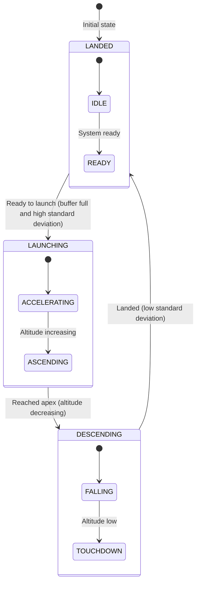
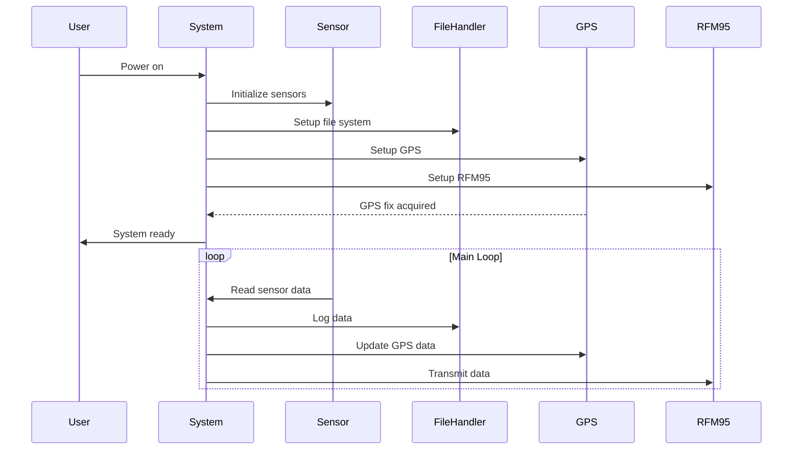
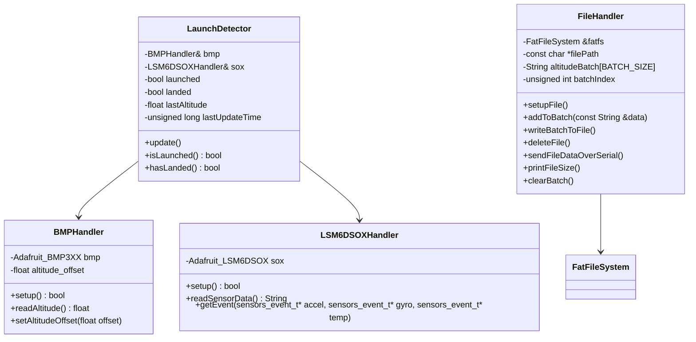

```mermaid
stateDiagram-v2
    [*] --> LANDED: Initial state
    LANDED --> LAUNCHING: Ready to launch (buffer full and high standard deviation)
    LAUNCHING --> DESCENDING: Reached apex (altitude decreasing)

    DESCENDING --> LANDED: Landed (low standard deviation)

    state LANDED {
        [*] --> IDLE
        IDLE --> READY: System ready
    }

    state LAUNCHING {
        [*] --> ACCELERATING
        ACCELERATING --> ASCENDING: Altitude increasing
    }

    state DESCENDING {
        [*] --> FALLING
        FALLING --> TOUCHDOWN: Altitude low
    }
```

```mermaid
sequenceDiagram
    participant User
    participant System
    participant Sensor
    participant FileHandler
    participant GPS
    participant RFM95

    User->>System: Power on
    System->>Sensor: Initialize sensors
    System->>FileHandler: Setup file system
    System->>GPS: Setup GPS
    System->>RFM95: Setup RFM95
    GPS-->>System: GPS fix acquired
    System->>User: System ready

    loop Main Loop
        Sensor->>System: Read sensor data
        System->>FileHandler: Log data
        System->>GPS: Update GPS data
        System->>RFM95: Transmit data
    end
```

```mermaid
classDiagram
    class LaunchDetector {
        +update()
        +isLaunched() bool
        +hasLanded() bool
        -BMPHandler& bmp
        -LSM6DSOXHandler& sox
        -bool launched
        -bool landed
        -float lastAltitude
        -unsigned long lastUpdateTime
    }

    class BMPHandler {
        +setup() bool
        +readAltitude() float
        +setAltitudeOffset(float offset)
        -Adafruit_BMP3XX bmp
        -float altitude_offset
    }

    class LSM6DSOXHandler {
        +setup() bool
        +readSensorData() String
        +getEvent(sensors_event_t* accel, sensors_event_t* gyro, sensors_event_t* temp)
        -Adafruit_LSM6DSOX sox
    }

    class FileHandler {
        +setupFile()
        +addToBatch(const String &data)
        +writeBatchToFile()
        +deleteFile()
        +sendFileDataOverSerial()
        +printFileSize()
        +clearBatch()
        -FatFileSystem &fatfs
        -const char *filePath
        -String altitudeBatch[BATCH_SIZE]
        -unsigned int batchIndex
    }

    LaunchDetector --> BMPHandler
    LaunchDetector --> LSM6DSOXHandler
    FileHandler --> FatFileSystem
```